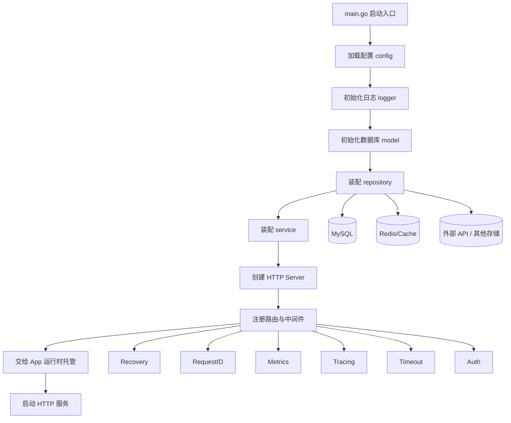
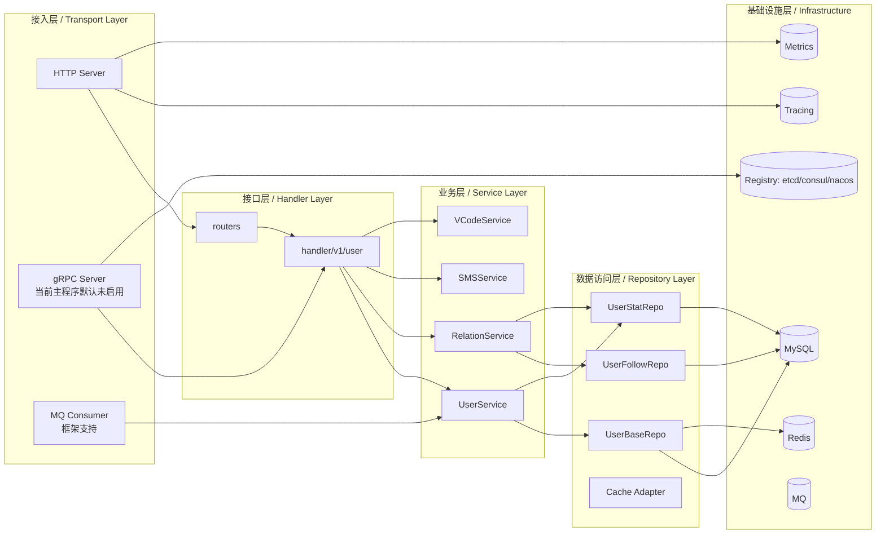
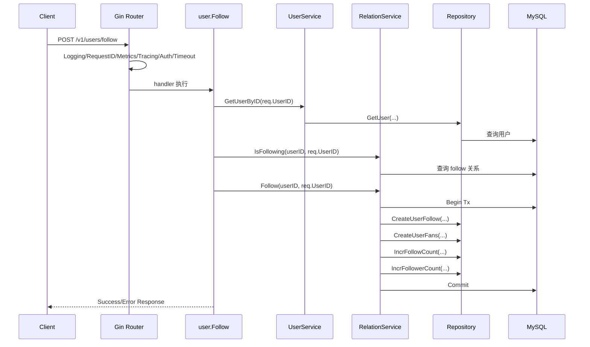

# Eagle 项目学习笔记

## 1. 项目当前定位

这个仓库当前更准确的定位是：

- 一个采用微服务设计思想的 Go 基础框架
- 一个已经落地了用户域示例业务的应用骨架

要先分清两层：

- 当前默认启动形态：`main.go` 默认启动的是一个 HTTP 服务
- 框架能力边界：项目同时具备 gRPC、注册发现、消息队列消费者、链路追踪、指标监控等微服务基础设施能力

也就是说，它现在不是“已经拆成很多独立业务服务的大型微服务系统”，而是“已经把未来微服务化需要的基础抽象先搭好”的项目。

关键入口：

- 启动入口：[main.go](/D:/Demo/full-stack-practice-plan/golang/eagle/main.go:1)
- 应用运行时：[pkg/app/app.go](/D:/Demo/full-stack-practice-plan/golang/eagle/pkg/app/app.go:1)
- HTTP Server 装配：[internal/server/http.go](/D:/Demo/full-stack-practice-plan/golang/eagle/internal/server/http.go:1)
- 路由与中间件：[internal/routers/router.go](/D:/Demo/full-stack-practice-plan/golang/eagle/internal/routers/router.go:1)
- Service 聚合入口：[internal/service/service.go](/D:/Demo/full-stack-practice-plan/golang/eagle/internal/service/service.go:1)
- Repository 聚合入口：[internal/repository/repository.go](/D:/Demo/full-stack-practice-plan/golang/eagle/internal/repository/repository.go:1)

---

## 2. 当前项目微服务分层图

### 2.1 当前默认运行形态



### 2.2 按职责理解的微服务分层



### 2.3 App 运行时在整体中的位置

`pkg/app.App` 是这个项目里很关键的一层。它不关心业务，只负责：

- 托管一个或多个服务端实例
- 启动和停止 `transport.Server`
- 接收系统信号并优雅退出
- 在配置了注册中心时自动注册/反注册服务实例
- 自动从 server 推导服务 endpoint

可以把它理解为项目自己的“轻量服务运行时容器”。

相关代码：

- [pkg/app/app.go](/D:/Demo/full-stack-practice-plan/golang/eagle/pkg/app/app.go:21)
- [pkg/app/options.go](/D:/Demo/full-stack-practice-plan/golang/eagle/pkg/app/options.go:13)
- [pkg/transport/transport.go](/D:/Demo/full-stack-practice-plan/golang/eagle/pkg/transport/transport.go:1)

---

## 3. 当前主程序启动调用链

### 3.1 从进程启动到 HTTP 服务起来

```text
main.main
  -> pflag.Parse
  -> config.New + Load(app)
  -> eagle.Conf = &cfg
  -> logger.Init()
  -> model.Init()
  -> model.GetDB()
  -> repository.New(db)
  -> service.New(repo)
  -> server.NewHTTPServer(&cfg.HTTP)
     -> routers.NewRouter()
        -> 注册全局中间件
        -> 注册 /health /metrics /swagger
        -> 注册 /v1 用户相关路由
  -> eagle.New(...)
  -> app.Run()
     -> buildInstance()
     -> srv.Start(ctx)
```

对应代码入口：

- [main.go](/D:/Demo/full-stack-practice-plan/golang/eagle/main.go:42)
- [internal/server/http.go](/D:/Demo/full-stack-practice-plan/golang/eagle/internal/server/http.go:10)
- [internal/routers/router.go](/D:/Demo/full-stack-practice-plan/golang/eagle/internal/routers/router.go:19)
- [pkg/app/app.go](/D:/Demo/full-stack-practice-plan/golang/eagle/pkg/app/app.go:54)

### 3.2 停止调用链

```text
OS Signal(SIGTERM/SIGQUIT/SIGINT)
  -> App.Run 中的 signal watcher 收到信号
  -> App.Stop()
  -> 如果配置了注册中心则先 Deregister
  -> cancel app context
  -> 各 transport.Server 执行 Stop(ctx)
```

这一段体现的是微服务里很重要的“优雅退出”和“服务实例生命周期管理”。

---

### 3.3 主流程调用层级总图

这一块先记一句总纲：

> 当前项目默认启动的是“一个 HTTP 服务”，但它外层套了一层通用 `App` 运行时，所以未来可以继续挂 `gRPC Server`、`MQ Consumer Server`、`Registry` 等能力。

```text
进程入口
main.main
  -> pflag.Parse
  -> config.New(...).Load("app", &cfg)
  -> eagle.Conf = &cfg
  -> logger.Init()
  -> model.Init()
  -> redis.Init()
  -> db := model.GetDB()
  -> repo := repository.New(db)
  -> service.Svc = service.New(repo)
  -> gin.SetMode(cfg.Mode)
  -> goroutine 启动 pprof HTTP
  -> httpServer := server.NewHTTPServer(&cfg.HTTP)
      -> routers.NewRouter()
          -> gin.New()
          -> use: Recovery / NoCache / Options / Secure
          -> use: Logging / RequestID / Metrics / Tracing / Timeout / Translations
          -> LoadWebRouter(...)
          -> register: /health /metrics /swagger
          -> register: /v1/register /v1/login /v1/users/... 等业务路由
  -> app := eagle.New(..., eagle.WithServer(httpServer))
  -> app.Run()
      -> buildInstance()
      -> 并发启动 server.Start(ctx)
      -> 监听 OS Signal
      -> 等待退出后触发 server.Stop(ctx)
```

可以把它拆成 3 个层次去记：

1. 启动装配层
   `main.go` 负责把配置、日志、数据库、Redis、Repository、Service、HTTP Server 全部组装起来。
2. 通用运行时层
   `pkg/app.App` 不关心用户业务，只关心“Server 怎么启动、怎么停止、要不要注册到注册中心、收到信号后如何优雅退出”。
3. 业务请求处理层
   HTTP 请求进入 Gin Router 后，依次经过中间件、路由分发、Handler、Service、Repository，最后访问 MySQL / Redis。

### 3.4 一条 HTTP 请求的层级穿透

如果从“调用层级”角度去背，可以直接记成下面这一条：

```text
Client
  -> Gin HTTP Server
  -> Global Middleware
  -> Router
  -> Handler
  -> Service
  -> Repository
  -> GORM / MySQL / Redis
  -> 返回 Response
```

对应到当前项目里的真实目录就是：

```text
main.go
  -> internal/server/http.go
  -> internal/routers/router.go
  -> internal/handler/v1/user/*.go
  -> internal/service/*.go
  -> internal/repository/*.go
  -> internal/model + pkg/storage/orm
  -> MySQL / Redis
```

这里最值得记住的一点是：

- `main.go` 解决“应用怎么装起来”
- `pkg/app` 解决“服务怎么跑、怎么停”
- `router + middleware` 解决“请求怎么接进来”
- `handler` 解决“参数绑定、鉴权、响应输出”
- `service` 解决“业务编排与事务边界”
- `repository` 解决“数据访问细节”

所以这个项目当前的主流程，本质上就是：

> `main.go` 完成装配，`App.Run()` 托管生命周期，`HTTP Server` 承接请求，`Handler -> Service -> Repository` 完成业务落地。

## 4. 一条典型业务请求调用链

这里选 `POST /v1/users/follow` 作为第一条推荐阅读链路，因为它同时覆盖：

- HTTP 路由
- 中间件
- handler 参数处理
- service 业务编排
- repository 数据落库
- 事务控制

### 4.1 Follow 请求调用链



推荐对照阅读：

- handler: [internal/handler/v1/user/follow.go](/D:/Demo/full-stack-practice-plan/golang/eagle/internal/handler/v1/user/follow.go:1)
- relation service: [internal/service/relation_service.go](/D:/Demo/full-stack-practice-plan/golang/eagle/internal/service/relation_service.go:1)
- user service: [internal/service/user_service.go](/D:/Demo/full-stack-practice-plan/golang/eagle/internal/service/user_service.go:1)
- repository 接口: [internal/repository/repository.go](/D:/Demo/full-stack-practice-plan/golang/eagle/internal/repository/repository.go:1)
- follow repo: [internal/repository/user_follow_repo.go](/D:/Demo/full-stack-practice-plan/golang/eagle/internal/repository/user_follow_repo.go:1)
- stat repo: [internal/repository/user_stat_repo.go](/D:/Demo/full-stack-practice-plan/golang/eagle/internal/repository/user_stat_repo.go:1)

### 4.2 这条链路里最值得学习的点

- handler 很薄，只负责参数绑定、鉴权后的入口判断、错误返回
- service 持有 repository，负责业务编排
- 事务边界放在 service，而不是散落在 handler
- repository 方法细分到表和数据动作，便于未来拆分

---

## 5. 当前项目的“微服务能力调用链”

虽然默认 `main.go` 只启 HTTP，但框架本身已经把微服务治理链路抽出来了。

### 5.1 注册发现调用链

当前主程序默认未启用注册中心，但示例已经给出：

- 示例入口：[examples/registry/main.go](/D:/Demo/full-stack-practice-plan/golang/eagle/examples/registry/main.go:1)

调用链如下：

```text
examples/registry/main.go
  -> 创建 etcd client
  -> etcd.New(client)
  -> eagle.New(..., WithRegistry(r))
  -> app.Run()
     -> buildInstance()
     -> registry.Register(instance)
     -> 服务运行期间心跳续租
     -> 停机时 Deregister
```

关键代码：

- [examples/registry/main.go](/D:/Demo/full-stack-practice-plan/golang/eagle/examples/registry/main.go:76)
- [pkg/registry/registry.go](/D:/Demo/full-stack-practice-plan/golang/eagle/pkg/registry/registry.go:1)
- [pkg/registry/etcd/registry.go](/D:/Demo/full-stack-practice-plan/golang/eagle/pkg/registry/etcd/registry.go:1)

### 5.2 gRPC 调用链

当前主程序默认未挂载 gRPC，但框架路径已经具备：

```text
业务实现
  -> internal/server.NewGRPCServer
  -> grpc.NewServer(...)
  -> 注册具体 protobuf service
  -> app.Run()
```

对应代码：

- [internal/server/grpc.go](/D:/Demo/full-stack-practice-plan/golang/eagle/internal/server/grpc.go:1)
- [pkg/transport/grpc/server.go](/D:/Demo/full-stack-practice-plan/golang/eagle/pkg/transport/grpc/server.go:1)
- 示例 server: [examples/helloworld/server/main.go](/D:/Demo/full-stack-practice-plan/golang/eagle/examples/helloworld/server/main.go:1)

### 5.3 gRPC 理论与原理速记

先记一句最核心的话：

> gRPC 是一种基于 HTTP/2 的高性能 RPC 通信框架，通常配合 Protobuf 做接口定义和数据传输，特别适合服务与服务之间的内部调用。

#### 5.3.1 gRPC 是什么

`RPC` 的核心思想不是“访问某个 URL”，而是“像调用本地函数一样调用远程服务方法”。

所以调用方更关心的是：

- 服务名是什么
- 方法名是什么
- 请求结构是什么
- 响应结构是什么

从抽象角度看：

- REST 更像：资源 + URL + HTTP Method
- gRPC 更像：服务 + 方法 + 请求对象 + 响应对象

#### 5.3.2 为什么微服务里常用 gRPC

gRPC 适合内部微服务通信，主要因为：

- 强类型
  由 `.proto` 统一定义接口契约，客户端和服务端都按同一份协议生成代码
- 性能更高
  常配合 Protobuf 二进制序列化，数据体积通常比 JSON 更小，编解码效率更高
- 跨语言
  同一个 `.proto` 可以生成 Go、Java、Python、Node 等多语言代码
- 更适合内部调用
  服务间更关注性能、稳定性、契约一致性，而不是浏览器直接调试的便利
- 支持流式通信
  除了普通请求响应，还支持客户端流、服务端流、双向流

#### 5.3.3 gRPC 和 Protobuf 的关系

这两个概念经常一起出现，但不是同一个东西：

- `gRPC` 解决“怎么发起远程调用”
- `Protobuf` 解决“接口长什么样、数据如何编码”

常见链路是：

```text
.proto 定义 service 和 message
  -> protoc 生成客户端 / 服务端代码
  -> 服务端实现方法
  -> 客户端像调本地方法一样发起远程调用
```

可以简单记成：

- `gRPC` 是通信框架
- `Protobuf` 是协议描述 + 序列化格式

#### 5.3.4 gRPC 底层大概做了什么

一次 gRPC 调用，底层大致是：

```text
客户端调用 stub 方法
  -> 请求对象按 Protobuf 编码
  -> 通过 HTTP/2 发给远端服务
  -> 服务端解码请求
  -> 执行业务方法
  -> 返回响应对象
  -> 响应再次编码后回传
```

这里最值得记住的两点：

- gRPC 底层通常跑在 `HTTP/2`
- 传输数据默认常是 `Protobuf` 二进制，不是 JSON

#### 5.3.5 和 HTTP + JSON API 的区别

学习阶段可以先这样理解：

- HTTP + JSON
  更适合浏览器、开放接口、第三方接入、人工调试
- gRPC
  更适合内部服务调用、强类型契约、跨语言、高性能通信

真实项目里很常见的分工是：

- 对外 API：HTTP + JSON
- 内部服务间：gRPC

#### 5.3.6 当前阶段我需要记住什么

对当前项目，先记住这几点就够：

1. 仓库已经具备 gRPC 能力
2. 当前 `main.go` 默认没有挂 gRPC Server
3. 后续真正做项目时，再重点看：
   - `.proto` 如何定义
   - 代码如何生成
   - 服务如何注册到 `grpc.Server`
   - client 如何发起调用
   - interceptor 如何接日志、Tracing、Metrics、Recovery

所以现在最重要的是先建立心智模型：

> gRPC 的本质，是面向“服务方法调用”的强类型远程通信机制；在微服务里，它最常见的价值，是替代一部分内部 HTTP + JSON 调用。

---

### 5.4 Kafka / RabbitMQ 知识点与常见场景速记

这一块先记一句总纲：

> `Kafka` 偏流式日志、可回放、吞吐优先；`RabbitMQ` 偏任务队列、路由灵活、可靠投递。

#### 5.4.1 为什么系统里需要消息队列

消息队列最核心的价值，不是“多一个中间件”，而是把原来同步强耦合的调用，改成异步解耦。

常见收益：

- 解耦
  下单服务不需要直接依赖短信服务、积分服务、通知服务是否在线
- 异步
  用户请求先快速返回，后面的非核心操作放到队列慢慢处理
- 削峰填谷
  高峰流量先写入队列，消费者按系统承受能力慢慢消费
- 广播分发
  一条业务事件可以让多个下游系统分别消费
- 故障缓冲
  下游短暂异常时，消息可以暂存，不一定立刻丢失

#### 5.4.2 Kafka 是什么

可以把 `Kafka` 理解成一个“分布式提交日志系统”或“高吞吐事件流平台”。

它最核心的几个概念是：

- `Topic`
  逻辑上的消息主题，比如 `order_created`
- `Partition`
  一个 Topic 会被切成多个分区，用来横向扩展吞吐
- `Offset`
  消息在分区里的顺序位置，消费者靠它记录“读到哪里了”
- `Producer`
  生产消息的一方
- `Consumer Group`
  一组共同消费同一个 Topic 的消费者，组内通常一条消息只会被其中一个消费者处理
- `Broker`
  Kafka 集群里的单个节点

学习 Kafka 时最重要的心智模型是：

- Kafka 更像“可顺序追加、可重复读取的日志”
- 消费者不是把消息从系统里“拿走”，而是“自己维护读到哪里”

所以它天然适合：

- 高吞吐事件流
- 行为日志采集
- 数据管道
- 事件驱动架构
- 需要回放历史消息的系统

#### 5.4.3 Kafka 的典型场景

- 用户行为埋点
  页面点击、曝光、停留时长、搜索行为统一写入 Kafka，再由下游分析
- 业务事件总线
  订单创建、支付成功、退款完成等事件发到 Topic，多个系统订阅
- 日志聚合
  应用日志、审计日志、访问日志批量汇聚后再入 ES / ClickHouse / 湖仓
- 流式计算
  与 Flink、Spark Streaming 等配合做实时风控、实时推荐、实时监控
- 大规模异步处理
  对吞吐要求极高，但对单条消息低延迟不那么敏感的系统

#### 5.4.4 Kafka 更擅长什么

- 吞吐大
- 分区扩展能力强
- 顺序消费模型清晰
- 消息保留时间可配置
- 可以回放历史消息
- 很适合“事件流”和“数据管道”

但也要知道它不是“什么都最优”：

- 业务路由能力不如 RabbitMQ 灵活
- 单条任务处理语义没有 RabbitMQ 那么直观
- 配置和运维复杂度通常更高

#### 5.4.5 RabbitMQ 是什么

可以把 `RabbitMQ` 理解成一个“面向可靠投递与灵活路由的消息代理 Broker”。

它更强调：

- 生产者把消息发给 Exchange
- Exchange 根据规则路由到一个或多个 Queue
- 消费者从 Queue 中消费消息

最核心的概念是：

- `Producer`
  生产者
- `Exchange`
  交换机，负责路由消息
- `Queue`
  队列，真正存储待消费消息
- `Binding`
  Exchange 和 Queue 的绑定关系
- `Routing Key`
  路由键，决定消息怎么分发
- `Consumer`
  消费者
- `Ack/Nack`
  消费确认 / 拒绝确认，用来控制消息是否算真正处理完成

学习 RabbitMQ 时最重要的心智模型是：

- RabbitMQ 更像“智能邮局”
- 生产者负责发信
- Exchange 负责按规则分拣
- Queue 负责暂存
- Consumer 负责处理

#### 5.4.6 RabbitMQ 的典型场景

- 异步任务队列
  发邮件、发短信、生成报表、生成缩略图
- 可靠任务分发
  希望消费者失败后可重试、可重新入队
- 多种路由模式
  一条消息按不同 routing key 分发给不同业务队列
- 工作队列
  多个 worker 共同消费任务，提升处理能力
- 延迟任务
  例如 30 分钟未支付取消订单、延迟通知

#### 5.4.7 RabbitMQ 更擅长什么

- 路由模型灵活
- 任务队列语义直观
- Ack / 重试 / 死信等机制比较成熟
- 对“业务任务投递”很友好
- 对单条消息处理可靠性要求较高时更常见

但也要知道它的边界：

- 大规模日志流和超高吞吐场景通常不如 Kafka
- 历史消息回放不是它的强项
- 更适合“任务分发”，不如 Kafka 那样天然偏“事件流平台”

#### 5.4.8 Kafka 和 RabbitMQ 的一张对比表

| 维度 | Kafka | RabbitMQ |
| --- | --- | --- |
| 核心定位 | 分布式日志 / 事件流平台 | 消息代理 / 任务队列 |
| 更关注 | 吞吐、分区、回放、流式处理 | 路由、可靠投递、任务消费 |
| 消费模型 | 记录 offset，自主推进消费位点 | 从队列取消息并 ack |
| 历史消息回放 | 强 | 弱 |
| 路由能力 | 相对简单 | 很灵活 |
| 典型强项 | 埋点、日志、事件总线、实时流处理 | 异步任务、通知、工作队列、延迟任务 |
| 常见关键词 | topic / partition / offset / consumer group | exchange / queue / binding / routing key / ack |

#### 5.4.9 实际项目里怎么选

可以先用这个简单判断：

- 如果你面对的是“大量事件流、日志流、可回放数据流”，优先想到 `Kafka`
- 如果你面对的是“业务任务投递、异步处理、失败重试、灵活路由”，优先想到 `RabbitMQ`

再进一步说：

- 订单创建后要通知多个下游系统，并且后面还可能做实时分析
  更偏 `Kafka`
- 用户注册后发欢迎短信、欢迎邮件、初始化用户资产
  更偏 `RabbitMQ`
- 海量用户行为埋点
  更偏 `Kafka`
- 图片处理、报表生成、站内信投递
  更偏 `RabbitMQ`

#### 5.4.10 当前阶段最值得先记住什么

对现阶段学习，先记住下面几句就够了：

1. `Kafka` 更像“高吞吐、可回放的事件日志系统”
2. `RabbitMQ` 更像“可靠、灵活、面向任务分发的消息代理”
3. 两者都能解耦、异步、削峰，但侧重点明显不同
4. 真正落到项目里时，不要先问“哪个更高级”，要先问“我的业务更像事件流，还是更像任务队列”

如果后面你开始结合项目代码继续学，再重点补这几块：

- 生产者怎么初始化
- 消费者怎么启动
- 消息重试和失败处理怎么做
- 幂等怎么保证
- 消息顺序性是否重要
- 如何避免消息重复消费带来的业务问题

---

## 6. 推荐阅读顺序

建议按下面顺序读，会比从 `pkg/` 乱翻更有效：

1. `main.go`
2. `internal/server/http.go`
3. `internal/routers/router.go`
4. `internal/handler/v1/user/*.go`
5. `internal/service/service.go`
6. `internal/service/user_service.go`
7. `internal/service/relation_service.go`
8. `internal/repository/repository.go`
9. `internal/repository/*.go`
10. `pkg/app/*`
11. `pkg/transport/http/*`
12. `pkg/transport/grpc/*`
13. `pkg/registry/*`
14. `pkg/queue/kafka/*`
15. `pkg/queue/rabbitmq/*`

### 6.1 当前最核心的代码链路

如果目标是先把“这个项目现在到底怎么跑起来”读透，那么最核心的仍然是这条 HTTP 主链路：

```text
main.go
  -> pkg/config
  -> pkg/log / pkg/storage / pkg/redis 初始化资源
  -> internal/service 组装业务服务
  -> internal/server/http.go
  -> internal/routers
  -> middleware
  -> handler
  -> service
  -> repository
  -> model
  -> MySQL / Redis
```

这一条链路对应的是“当前默认应用形态”，也就是：

- `main.go` 默认只挂载了 HTTP Server
- 当前业务代码主要围绕 Gin 路由、Handler、Service、Repository 展开
- 所以你前面总结的这些目录，确实就是当前最值得优先吃透的主干

### 6.2 需要区分“当前主程序链路”与“框架扩展能力”

这个仓库既是一个业务示例，也是一个微服务基础框架，所以阅读时要刻意区分两层：

- 当前主程序实际启用的链路：HTTP + DB + Redis + Middleware + Service
- 框架已经提供但当前 `main.go` 没默认启用的能力：gRPC、注册发现、Kafka、RabbitMQ、Consumer Server

也就是说：

- `gRPC` 不是没有，只是当前默认启动流程没有把它接入 `app.Run()`
- `Kafka` 和 `RabbitMQ` 不是没有，只是更多以 `pkg/queue/*` 和 `examples/*` 的方式提供
- `registry` 也是一样，`pkg/app` 已经支持 `WithRegistry(...)`，但当前主程序没有传入

从“学习优先级”上说，应该先把当前主链路看透，再去看这些扩展能力。

### 6.3 我当前还没看完但后面要补的内容

如果按微服务能力补齐，后面还应该继续看：

1. `gRPC`
   重点看 `pkg/transport/grpc`、`internal/server/grpc.go`、`examples/helloworld`
2. `Registry`
   重点看 `pkg/registry/*`、`pkg/app/app.go` 中的 Register / Deregister 流程
3. `Kafka`
   重点看 `pkg/queue/kafka/*`、`examples/queue/kafka/main.go`
4. `RabbitMQ`
   重点看 `pkg/queue/rabbitmq/*`、`pkg/transport/consumer/rabbitmq/server.go`

所以可以把当前学习状态理解为：

- HTTP 业务主链路已经基本摸清
- 微服务扩展能力还差 gRPC / Registry / Kafka / RabbitMQ 这几块要继续补
- 这些内容不是“项目里没有”，而是“仓库里有能力，但当前默认 demo 没全部启用”

---

## 7. 我当前对这个项目结构的总结

一句话总结：

> Eagle 当前是一个“先把微服务基础抽象搭好，再承载具体业务模块”的 Go 服务框架。

阅读时要重点抓这几个核心边界：

- `App` 解决“服务怎么跑、怎么停、怎么注册”
- `Server/Router/Handler` 解决“请求怎么进来”
- `Service` 解决“业务怎么编排”
- `Repository` 解决“数据和外部资源怎么访问”
- `pkg/registry`、`pkg/transport`、`pkg/middleware` 解决“微服务基础设施能力怎么复用”

---

## 8. 后续学习记录建议

后面我建议继续在这个文档里补下面几块：

- 每一层的职责边界
- 用户模块完整时序图
- 缓存设计与一致性策略
- 注册发现与服务治理机制
- gRPC 与 HTTP 的统一抽象
- 当前实现中“理念很好但落地还不完全一致”的地方
