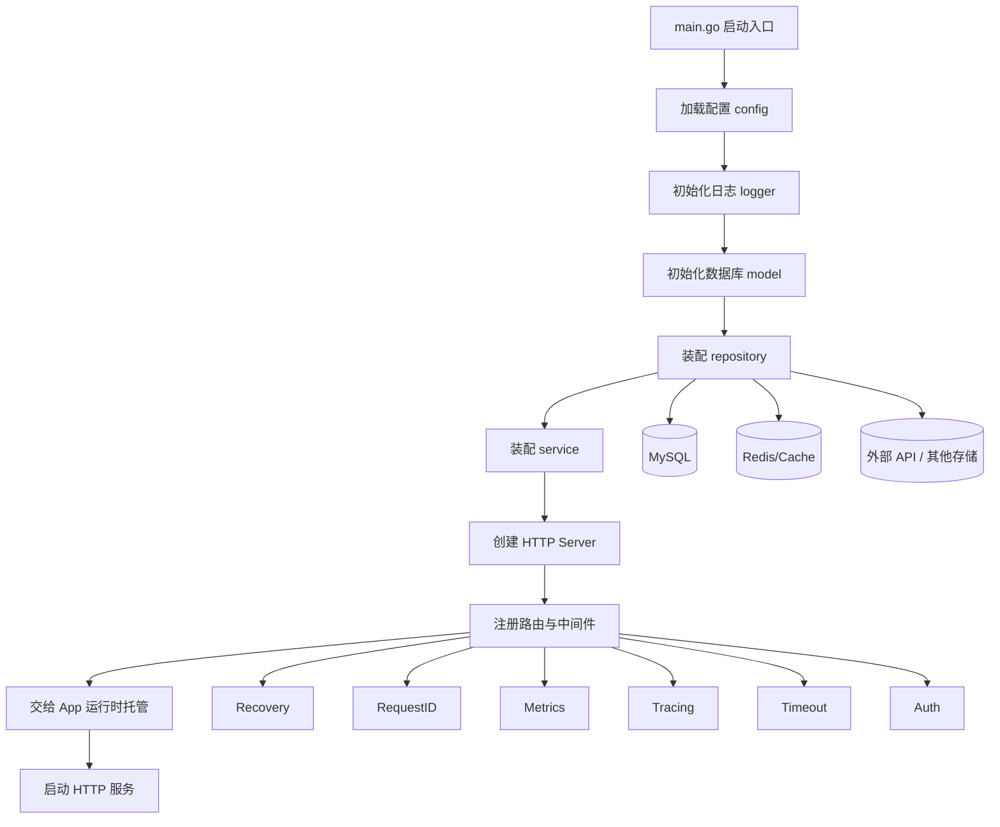
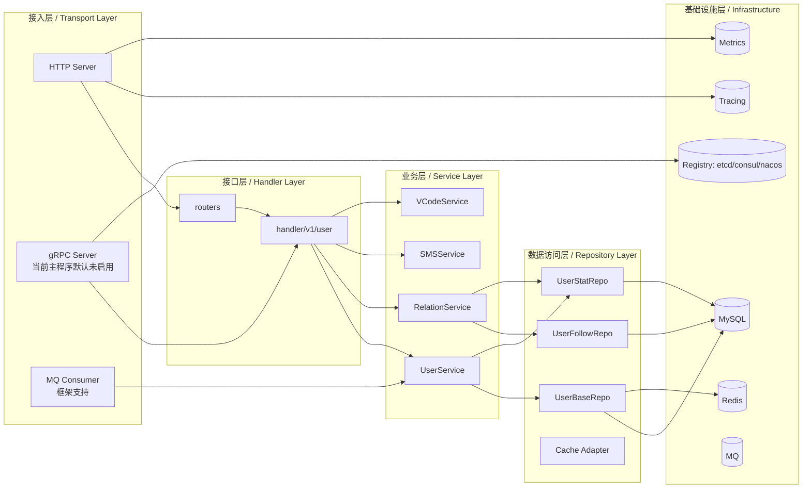
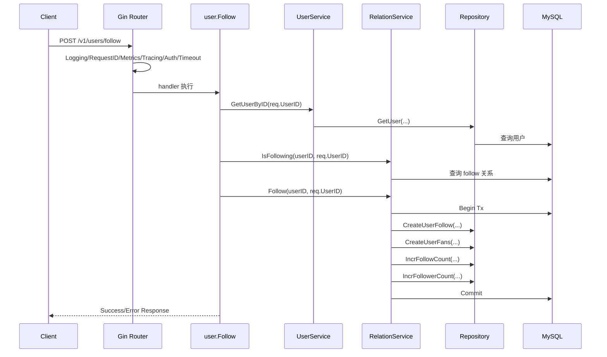

# Eagle 项目学习笔记

## 1. 项目当前定位

这个仓库当前更准确的定位是：

- 一个采用微服务设计思想的 Go 基础框架
- 一个已经落地了用户域示例业务的应用骨架

要先分清两层：

- 当前默认启动形态：`main.go` 默认启动的是一个 HTTP 服务
- 框架能力边界：项目同时具备 gRPC、注册发现、消息队列消费者、链路追踪、指标监控等微服务基础设施能力

也就是说，它现在不是“已经拆成很多独立业务服务的大型微服务系统”，而是“已经把未来微服务化需要的基础抽象先搭好”的项目。

关键入口：

- 启动入口：[main.go](/D:/Demo/full-stack-practice-plan/golang/eagle/main.go:1)
- 应用运行时：[pkg/app/app.go](/D:/Demo/full-stack-practice-plan/golang/eagle/pkg/app/app.go:1)
- HTTP Server 装配：[internal/server/http.go](/D:/Demo/full-stack-practice-plan/golang/eagle/internal/server/http.go:1)
- 路由与中间件：[internal/routers/router.go](/D:/Demo/full-stack-practice-plan/golang/eagle/internal/routers/router.go:1)
- Service 聚合入口：[internal/service/service.go](/D:/Demo/full-stack-practice-plan/golang/eagle/internal/service/service.go:1)
- Repository 聚合入口：[internal/repository/repository.go](/D:/Demo/full-stack-practice-plan/golang/eagle/internal/repository/repository.go:1)

---

## 2. 当前项目微服务分层图

### 2.1 当前默认运行形态



### 2.2 按职责理解的微服务分层



### 2.3 App 运行时在整体中的位置

`pkg/app.App` 是这个项目里很关键的一层。它不关心业务，只负责：

- 托管一个或多个服务端实例
- 启动和停止 `transport.Server`
- 接收系统信号并优雅退出
- 在配置了注册中心时自动注册/反注册服务实例
- 自动从 server 推导服务 endpoint

可以把它理解为项目自己的“轻量服务运行时容器”。

相关代码：

- [pkg/app/app.go](/D:/Demo/full-stack-practice-plan/golang/eagle/pkg/app/app.go:21)
- [pkg/app/options.go](/D:/Demo/full-stack-practice-plan/golang/eagle/pkg/app/options.go:13)
- [pkg/transport/transport.go](/D:/Demo/full-stack-practice-plan/golang/eagle/pkg/transport/transport.go:1)

---

## 3. 当前主程序启动调用链

### 3.1 从进程启动到 HTTP 服务起来

```text
main.main
  -> pflag.Parse
  -> config.New + Load(app)
  -> eagle.Conf = &cfg
  -> logger.Init()
  -> model.Init()
  -> model.GetDB()
  -> repository.New(db)
  -> service.New(repo)
  -> server.NewHTTPServer(&cfg.HTTP)
     -> routers.NewRouter()
        -> 注册全局中间件
        -> 注册 /health /metrics /swagger
        -> 注册 /v1 用户相关路由
  -> eagle.New(...)
  -> app.Run()
     -> buildInstance()
     -> srv.Start(ctx)
```

对应代码入口：

- [main.go](/D:/Demo/full-stack-practice-plan/golang/eagle/main.go:42)
- [internal/server/http.go](/D:/Demo/full-stack-practice-plan/golang/eagle/internal/server/http.go:10)
- [internal/routers/router.go](/D:/Demo/full-stack-practice-plan/golang/eagle/internal/routers/router.go:19)
- [pkg/app/app.go](/D:/Demo/full-stack-practice-plan/golang/eagle/pkg/app/app.go:54)

### 3.2 停止调用链

```text
OS Signal(SIGTERM/SIGQUIT/SIGINT)
  -> App.Run 中的 signal watcher 收到信号
  -> App.Stop()
  -> 如果配置了注册中心则先 Deregister
  -> cancel app context
  -> 各 transport.Server 执行 Stop(ctx)
```

这一段体现的是微服务里很重要的“优雅退出”和“服务实例生命周期管理”。

---

## 4. 一条典型业务请求调用链

这里选 `POST /v1/users/follow` 作为第一条推荐阅读链路，因为它同时覆盖：

- HTTP 路由
- 中间件
- handler 参数处理
- service 业务编排
- repository 数据落库
- 事务控制

### 4.1 Follow 请求调用链



推荐对照阅读：

- handler: [internal/handler/v1/user/follow.go](/D:/Demo/full-stack-practice-plan/golang/eagle/internal/handler/v1/user/follow.go:1)
- relation service: [internal/service/relation_service.go](/D:/Demo/full-stack-practice-plan/golang/eagle/internal/service/relation_service.go:1)
- user service: [internal/service/user_service.go](/D:/Demo/full-stack-practice-plan/golang/eagle/internal/service/user_service.go:1)
- repository 接口: [internal/repository/repository.go](/D:/Demo/full-stack-practice-plan/golang/eagle/internal/repository/repository.go:1)
- follow repo: [internal/repository/user_follow_repo.go](/D:/Demo/full-stack-practice-plan/golang/eagle/internal/repository/user_follow_repo.go:1)
- stat repo: [internal/repository/user_stat_repo.go](/D:/Demo/full-stack-practice-plan/golang/eagle/internal/repository/user_stat_repo.go:1)

### 4.2 这条链路里最值得学习的点

- handler 很薄，只负责参数绑定、鉴权后的入口判断、错误返回
- service 持有 repository，负责业务编排
- 事务边界放在 service，而不是散落在 handler
- repository 方法细分到表和数据动作，便于未来拆分

---

## 5. 当前项目的“微服务能力调用链”

虽然默认 `main.go` 只启 HTTP，但框架本身已经把微服务治理链路抽出来了。

### 5.1 注册发现调用链

当前主程序默认未启用注册中心，但示例已经给出：

- 示例入口：[examples/registry/main.go](/D:/Demo/full-stack-practice-plan/golang/eagle/examples/registry/main.go:1)

调用链如下：

```text
examples/registry/main.go
  -> 创建 etcd client
  -> etcd.New(client)
  -> eagle.New(..., WithRegistry(r))
  -> app.Run()
     -> buildInstance()
     -> registry.Register(instance)
     -> 服务运行期间心跳续租
     -> 停机时 Deregister
```

关键代码：

- [examples/registry/main.go](/D:/Demo/full-stack-practice-plan/golang/eagle/examples/registry/main.go:76)
- [pkg/registry/registry.go](/D:/Demo/full-stack-practice-plan/golang/eagle/pkg/registry/registry.go:1)
- [pkg/registry/etcd/registry.go](/D:/Demo/full-stack-practice-plan/golang/eagle/pkg/registry/etcd/registry.go:1)

### 5.2 gRPC 调用链

当前主程序默认未挂载 gRPC，但框架路径已经具备：

```text
业务实现
  -> internal/server.NewGRPCServer
  -> grpc.NewServer(...)
  -> 注册具体 protobuf service
  -> app.Run()
```

对应代码：

- [internal/server/grpc.go](/D:/Demo/full-stack-practice-plan/golang/eagle/internal/server/grpc.go:1)
- [pkg/transport/grpc/server.go](/D:/Demo/full-stack-practice-plan/golang/eagle/pkg/transport/grpc/server.go:1)
- 示例 server: [examples/helloworld/server/main.go](/D:/Demo/full-stack-practice-plan/golang/eagle/examples/helloworld/server/main.go:1)

---

## 6. 推荐阅读顺序

建议按下面顺序读，会比从 `pkg/` 乱翻更有效：

1. `main.go`
2. `internal/server/http.go`
3. `internal/routers/router.go`
4. `internal/handler/v1/user/*.go`
5. `internal/service/service.go`
6. `internal/service/user_service.go`
7. `internal/service/relation_service.go`
8. `internal/repository/repository.go`
9. `internal/repository/*.go`
10. `pkg/app/*`
11. `pkg/transport/http/*`
12. `pkg/transport/grpc/*`
13. `pkg/registry/*`

---

## 7. 我当前对这个项目结构的总结

一句话总结：

> Eagle 当前是一个“先把微服务基础抽象搭好，再承载具体业务模块”的 Go 服务框架。

阅读时要重点抓这几个核心边界：

- `App` 解决“服务怎么跑、怎么停、怎么注册”
- `Server/Router/Handler` 解决“请求怎么进来”
- `Service` 解决“业务怎么编排”
- `Repository` 解决“数据和外部资源怎么访问”
- `pkg/registry`、`pkg/transport`、`pkg/middleware` 解决“微服务基础设施能力怎么复用”

---

## 8. 后续学习记录建议

后面我建议继续在这个文档里补下面几块：

- 每一层的职责边界
- 用户模块完整时序图
- 缓存设计与一致性策略
- 注册发现与服务治理机制
- gRPC 与 HTTP 的统一抽象
- 当前实现中“理念很好但落地还不完全一致”的地方
